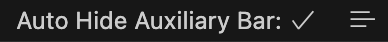

# Auto Hide Auxiliary Bar

Automatically hide auxiliary bar (second side bar) when more than one visible text editors.

You can show/hide auxiliary bar and on/off auto hide functionaly in status bar:

## Configurations

<!-- configs -->

| Key                                  | Description                                                                                 | Type      | Default |
| ------------------------------------ | ------------------------------------------------------------------------------------------- | --------- | ------- |
| `autoHideAuxiliaryBar.enableFeature` | Automatically hide auxiliary bar (second side bar) when more than one visible text editors. | `boolean` | `true`  |

<!-- configs -->

## Commands

<!-- commands -->

| Command                                    | Title                           |
| ------------------------------------------ | ------------------------------- |
| `autoHideAuxiliaryBar.toggleEnableFeature` | Auto Hide Auxiliary Bar: Toggle |

<!-- commands -->

## License

[MIT](./LICENSE.md) License © 2025 [Gábor Torma](https://github.com/gabortorma)
